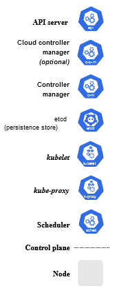

# Kubernetes Zero To Pro ✨


<br/>

### ⛏️ ***"A stone is broken by the last stroke of the hammer. This does not mean that the first stroke was useless. Success is the result of continuous effort."*** ⛏️

<br>

## ***Table*** *of* ***`Contents`*** 📜

* 🗃️ [***resources***](00-resources/README.md)
* 🧠 [***core concepts***](01-core-concepts/README.md)
* ⚙️ [***configuration***](02-configuration/README.md)
* 🐳<sup>🐳</sup> [***multi-container pods***](03-multi-container-pods/README.md)
* 🔬 [***observability***](04-observability/README.md)
* 💠 [***pod design***](05-pod-design/README.md)
* 🤯 [***advanced services*** *and* ***networking***](06-adv-services-and-networking/README.md)
* 🗄️ [***state persistence***](07-state-persistence/README.md)

<br />

## ***Kubernetes*** `Architecture` 🏗️

***Kubernetes coordinates a highly available cluster of computers that are connected to work as a single unit.***

<br>

 

* The **`Control Plane`** is responsible for *managing the cluster*.

  * **Components**

    * `kube-apiserver` - Exposes the `Kubernetes API`
    * `etcd` - *Consistent and highly-available key value store* used as Kubernetes' backing store for all cluster data.
    * `kube-scheduler` - Watches for newly created `Pods` with no assigned `node`, and selects a `node` for them to run on.
    * `kube-controller-manager` - Runs `controller` processes. Each `controller` is a separate process but to keep things simple they are compiled together and run in a single process
      * Examples
        * `Node controller`: Responsible for noticing and responding when `nodes` go down.
        * `Job controller`: Watches for Job objects that represent one-off tasks, then creates `Pods` to run those tasks to **completion**.
        * `Endpoints controller`: Populates the Endpoints object (that is, joins Services & Pods).
        * `Service Account` & `Token controllers`: Create default accounts and `API` *access tokens* for new `namespaces`

    * `cloud-controller-manager` - Embeds cloud-specific control logic
      * `Node`, `Route`, and `Service controllers` can have cloud provider dependencies.

<br/>

* A `Node` is a `VM` or a *physical computer* that serves as a *worker machine* in a `Kubernetes` cluster.
  * The `nodes` communicate with the control plane using the `Kubernetes API`

  * **Components**
    * `kubelet` - An agent that runs on each node in the cluster. It makes sure that `containers` are running in a `Pod`.
      * `kube-proxy` - Network proxy that runs on each `node` in your cluster, implementing part of the *`Kubernetes` Service concept*.
    * `Container runtime` - **Software** that is *responsible for running* `containers`.

<br>

## **Basic** `Commands` 📝

* ## `kubectl` **commands** 

  * **check** version of `Kubernetes` being used

    ```bash
    kubectl version
    ```

  * **get** *everything*

    ```bash
    kubectl get all
    ```

  * **get** api `resources` includes *name*, *shortnames*, *api version*, if *namespaced*, and *kind*

    ```bash
    kubectl api-resources
    ```

  * **get** kube-api `version`

    ```bash
    kubectl api-versions
    ```

  * all resources in kubernetes are grouped into `API groups`
    * under each `API group` are `API resources`

      ```bash
      kubectl api-resources
      ```

      * `API resources` are the *objects* that can be have **verbs** act on them from the `Kubernetes API`
        * ***verbs***: `create`, `get`, `describe`, `delete`, `update`, `watch`, `list`

  * identify `kube-apiserver` settings

    ```bash
    kubectl describe pod kube-apiserver-controlplane -n kube-system
    ```

* ## `minikube` **commands** 

  * Check the status of `minikube`

    ```bash
    minikube status
    ```

  * *start* `minikube`

    ```bash
    minikube start
    ```

  * **stop** `minikube`

    ```bash
    minikube stop
    ```
